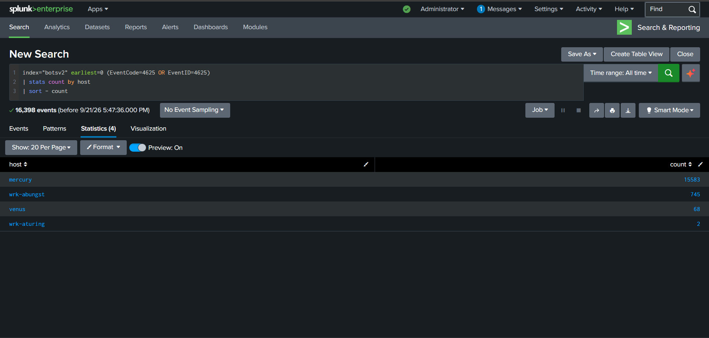
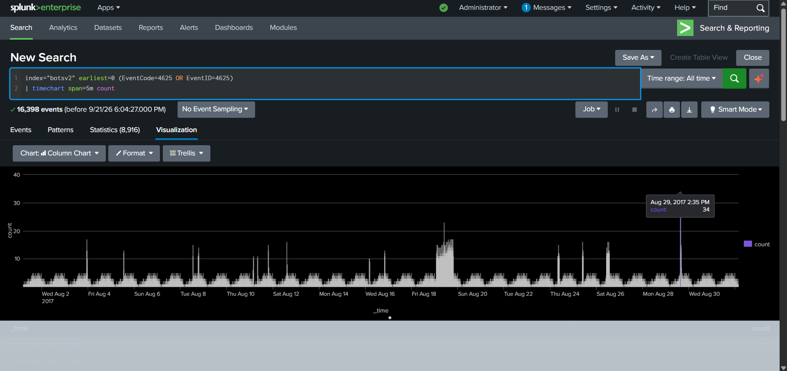
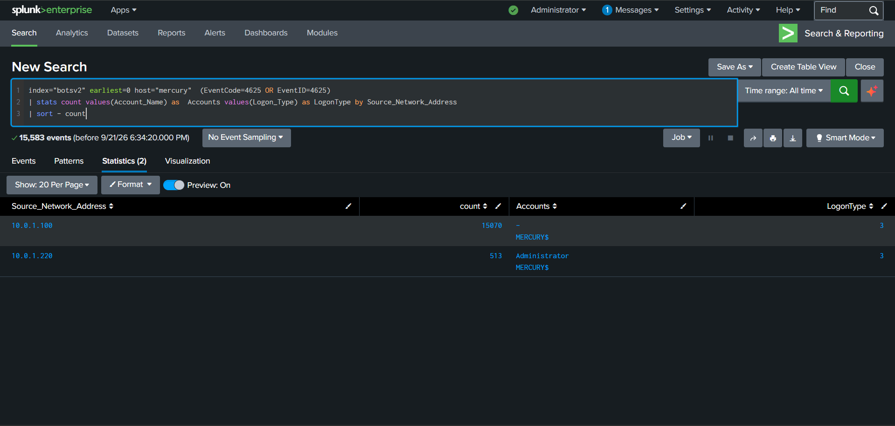
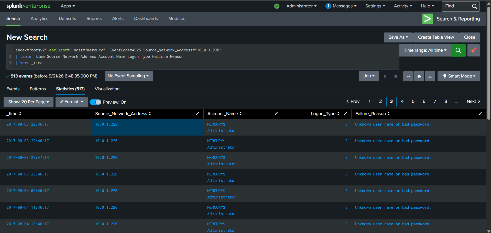
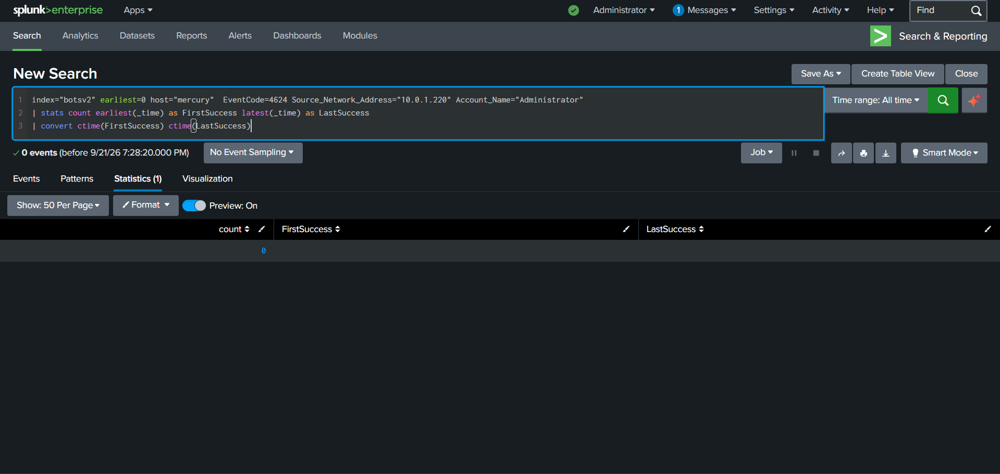
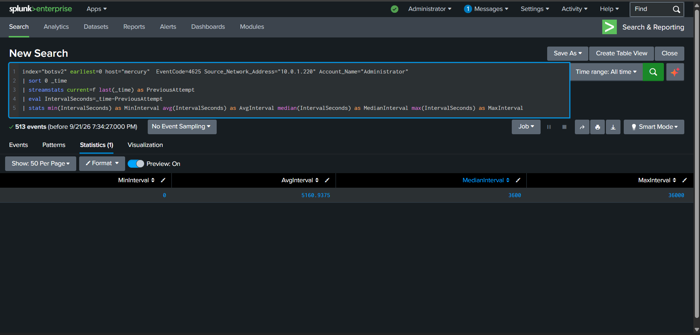
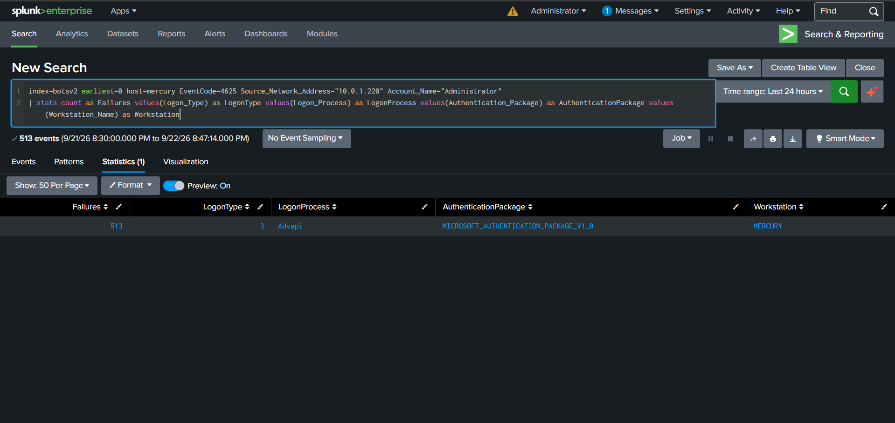
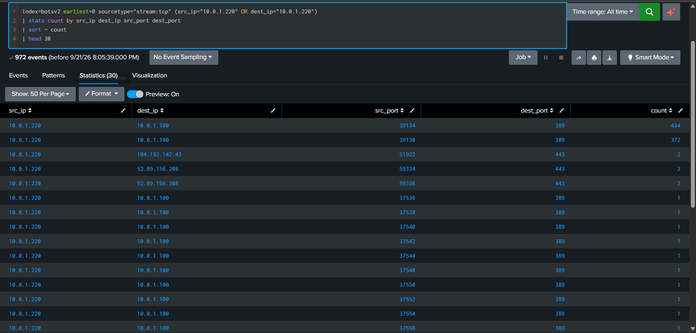

## Splunk-botsv2-Investigation
#Scrutinizing and Investigating Windows, Linux, and Network logs with the Splunk 
A Blue Team / SOC investigation using Splunk Enterprise and the BOTSv2 dataset.

The goal of this project was to investigate a large volume of Windows authentication failures, narrow the scope to the most relevant activity, correlate Windows authentication logs with network telemetry, and determine whether the behavior was consistent with brute-force activity or another authentication anomaly.

---

 **Investigation Summary**

The investigation started with Windows Event ID 4625 failed logons across the BOTSv2 dataset.

A total of **16,398 failed logon events** were identified. The host `mercury` accounted for **15,583** of them, so it became the primary focus of the investigation.

The scope was later narrowed to **513 failed authentication events** involving the privileged `Administrator` account and source address `10.0.1.220`.

---

**1. Initial Triage — Failed Logons by Host**

The first step was to identify which systems generated the highest number of Windows Event ID 4625 failed logons.

`mercury` generated **15,583 out of 16,398** failed authentication events, making it the primary host selected for deeper investigation.

---

**2. Failed Authentication Activity Over Time**

Failed authentication events were plotted over time using five-minute intervals.

The timeline showed recurring authentication failures throughout August 2017, including several short-lived spikes.

One notable interval on August 29 contained approximately *34 failed logon events within five minutes*.

---

**3. Source Address and Account Correlation**

After narrowing the investigation to `mercury`, the source network addresses, associated accounts, and logon types were examined.

Two main source addresses were identified:

- `10.0.1.100` — 15,070 failed logon events
- `10.0.1.220` — 513 failed logon events

The 513 events associated with `10.0.1.220` involved the privileged `Administrator` account.

All observed events used *Logon Type 3*, which represents a network logon.

---

**4. Administrator Authentication Failure Details**

The 513 events associated with `10.0.1.220` were investigated in greater detail because they involved a privileged account.

The observed characteristics were:

| Field | Value |
|:---:|:---:|
| Source address | `10.0.1.220` |
| Destination host | `mercury` |
| Account | `Administrator` |
| Event ID | `4625` |
| Logon Type | `3` |
| Failure Reason | `Unknown user name or bad password` |

The repeated failures against a privileged account made this activity worth further investigation.

---

**5. Successful Logon Correlation**

The next step was to determine whether the same source successfully authenticated using the `Administrator` account.

Windows Event ID 4624 was searched using the same source address, host, and account combination.

No corresponding successful authentication was observed.

---

**6. Authentication Periodicity Analysis**

The time intervals between consecutive failed authentication events were calculated.

The analysis showed a median interval of:

**3,600 seconds — approximately one hour**

This recurring timing pattern suggested automated authentication activity rather than conventional high-rate password guessing or brute-force behavior.

---

**7. Authentication Context**

Additional Windows authentication fields were examined to better understand the activity.

The 513 investigated events showed:

| Field | Value |
|---|---|
| Failures | `513` |
| Logon Type | `3` |
| Logon Process | `Advapi` |
| Authentication Package | `MICROSOFT_AUTHENTICATION_PACKAGE_V1_0` |
| Workstation | `MERCURY` |

These fields are consistent with Windows network authentication.

However, they do not conclusively identify the exact application or service responsible for generating the authentication attempts.

---

**8. Network Telemetry Correlation**

Splunk Stream telemetry was used to correlate the authentication activity with network traffic.

Repeated TCP communication was observed from:

`10.0.1.220`

to:

`10.0.1.100`

on destination port:

`389/TCP`

TCP port 389 is commonly associated with LDAP traffic.

This network activity provided additional context for the recurring Windows network authentication failures.

---

## Final Assessment

The investigation initially raised suspicion of possible brute-force activity because of the high volume of Windows Event ID 4625 failed logons.

After narrowing the scope, 513 failed network authentication events involving the privileged `Administrator` account were identified from source `10.0.1.220`.

No corresponding successful Event ID 4624 authentication was observed for the same source/account combination.

The activity showed a median recurrence interval of approximately one hour and consistently used Windows network authentication mechanisms. Network telemetry also showed repeated communication from `10.0.1.220` to `10.0.1.100` over TCP/389.

Based on the recurring timing pattern and the absence of successful authentication, the behavior is more consistent with an automated process or misconfigured service repeatedly using invalid credentials than with conventional high-rate brute-force activity.

The exact originating application could not be conclusively identified from the available telemetry.

---

## Splunk Dashboard

The final Splunk dashboard consolidates the main investigation findings, including:

- Failed authentication metrics
- Authentication activity over time
- Source address information
- Privileged account activity
- Authentication context
- Periodicity analysis
- Network telemetry correlation

The dashboard source is available here:

[`dashboards/authentication_failure_investigation.xml`](dashboards/authentication_failure_investigation.xml)

Importing the Dashboard

1. Create a Classic / Simple XML dashboard in Splunk.
2. Open *Edit → Source*.
3. Replace the existing XML with the contents of the dashboard file.
4. Save the dashboard.

---

## SPL Queries

All SPL queries used during the investigation are available here:

[`queries/authentication_investigation.spl`](queries/authentication_investigation.spl)

The query file contains the searches used for:

- Initial host triage
- Timeline analysis
- Source and account correlation
- Administrator authentication analysis
- Successful logon correlation
- Periodicity analysis
- Authentication context
- Network telemetry correlation
